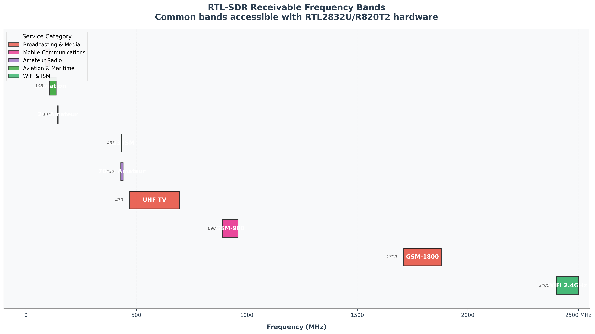
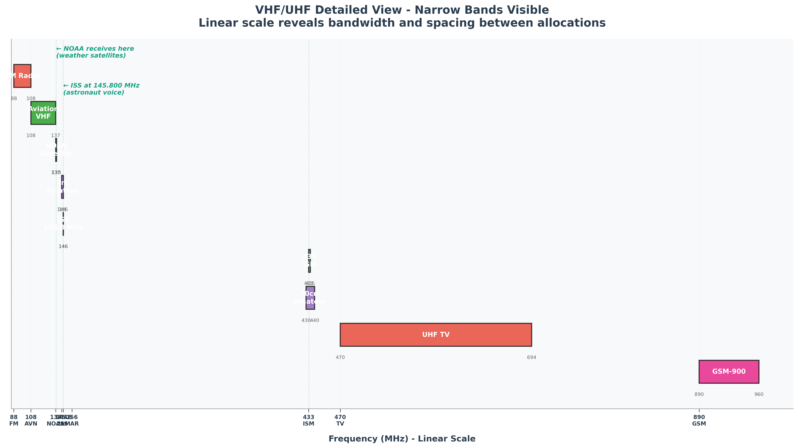
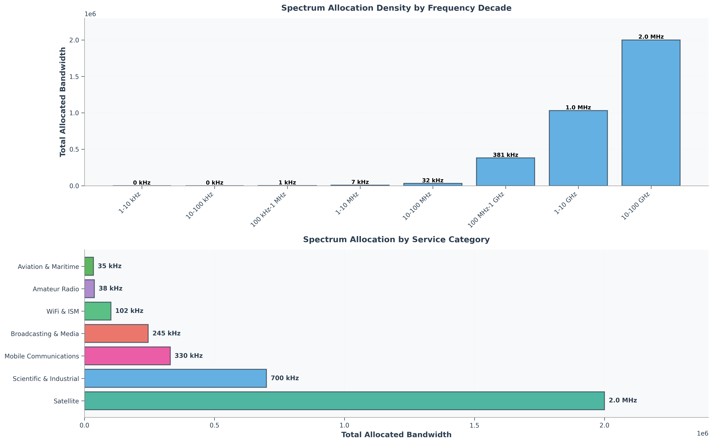
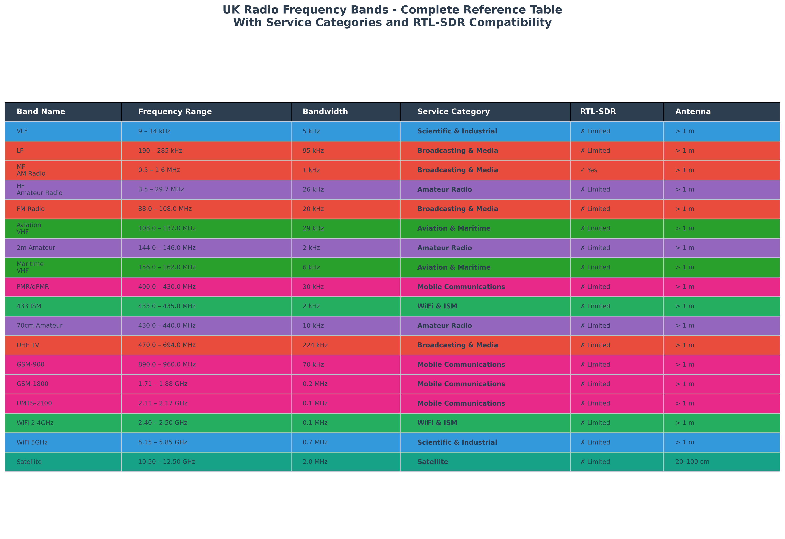
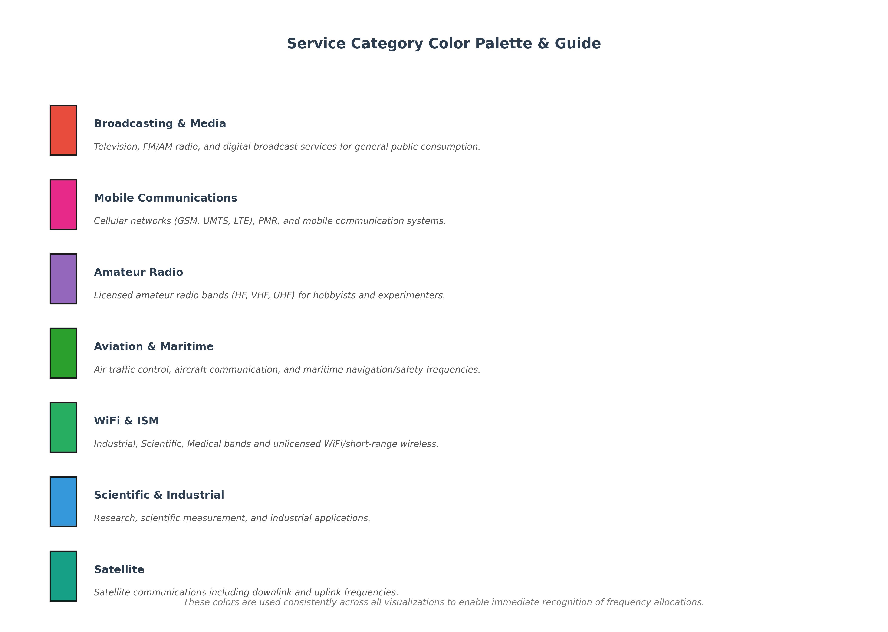

# RTL-SDR Blog V4 - Complete Setup & Project Guide

A comprehensive guide for setting up the RTL-SDR Blog V4 software-defined radio on macOS. Includes installation instructions, frequency reference tables, antenna configurations, and ready-to-use scripts for common radio reception projects.

Perfect for beginners and experienced radio enthusiasts interested in exploring the radio spectrum.

---

## Repository Structure

```
├── README.md                          (this file)
├── LICENSE                            (MIT License)
├── .gitignore
│
├── scripts/                           (Ready-to-use tools)
│   ├── aircraft_radar_setup.sh       (Live ADS-B aircraft tracking)
│   └── satellite_tracker.py          (Predict satellite passes)
│
├── docs/                              (Setup & Reference)
│   ├── ANTENNA_SETUP.md              (Hardware assembly guide)
│   ├── FREQUENCY_REFERENCE.md        (Frequency database + antenna lengths)
│   └── PREPARATION_SUMMARY.md        (Pre-setup checklist)
│
├── projects/                          (Detailed Project Guides)
│   ├── fm-radio.md                   (Start here - easiest)
│   ├── aircraft-radar.md             (Live aircraft tracking)
│   ├── weather-satellites.md         (Weather image decoding)
│   ├── wireless-sensors.md           (IoT device detection)
│   └── iss-reception.md              (ISS voice & data)
│
├── hardware/                          (Hardware Reference)
│   └── antenna-configurations.md     (Antenna optimization guide)
│
└── img/                               (Publication-quality Spectrum Visualizations)
    ├── uk_spectrum_viz.py            (Script to generate all plots)
    │
    ├── spectrum_analysis/            (Core spectrum analysis plots)
    │   ├── spectrum_density.png          (Allocation density & distribution)
    │   └── color_palette_guide.png       (Service category color reference)
    │
    ├── rtl_sdr/                      (RTL-SDR specific visualizations)
    │   ├── rtl_sdr_bands.png         (Receivable frequency bands with hardware info)
    │   └── vhf_uhf_detail.png        (Linear-scale detail view showing narrow bands)
    │
    └── reference/                    (Reference tables & lookups)
        └── frequency_reference_table.png (Complete band reference table)
```

---

## Quick Start (5 minutes)

### 1. Install Software
See `docs/ANTENNA_SETUP.md` for:
- RTL-SDR Blog custom driver installation
- SDR++ software setup
- macOS configuration

### 2. Assemble Hardware
- Extend antenna rods
- Connect coax cable
- Plug into MacBook

### 3. First Test: FM Radio
```bash
# Open SDR++
# 1. Click play button
# 2. Tune to 100 MHz
# 3. Should hear FM stations
```

---

## 5 Beginner Projects

Start with **FM Radio** (easiest), then choose your next project:

| Project | Difficulty | Time | What You'll Do |
|---------|-----------|------|----------------|
| [**FM Radio**](projects/fm-radio.md) | Beginner | 5 min | Listen to FM stations |
| [**Aircraft Radar**](projects/aircraft-radar.md) | Beginner | 5 min | Track live aircraft |
| [**Wireless Sensors**](projects/wireless-sensors.md) | Beginner | 5 min | Detect IoT devices |
| [**Weather Satellites**](projects/weather-satellites.md) | Intermediate | 20 min | Decode satellite images |
| [**ISS Reception**](projects/iss-reception.md) | Intermediate | 10 min | Hear astronauts |

**Click project name above to see detailed guide.**

---

## Documentation Quick Links

| Document | Purpose |
|----------|---------|
| [**ANTENNA_SETUP.md**](docs/ANTENNA_SETUP.md) | Hardware assembly, drivers, troubleshooting |
| [**FREQUENCY_REFERENCE.md**](docs/FREQUENCY_REFERENCE.md) | Complete frequency database with antenna configs |
| [**PREPARATION_SUMMARY.md**](docs/PREPARATION_SUMMARY.md) | Setup verification checklist |
| [**antenna-configurations.md**](hardware/antenna-configurations.md) | Antenna optimization for specific frequencies |

---

## Ready-to-Use Scripts

### Aircraft Radar (ADS-B)
Live aircraft tracking on a web map. See planes in real-time with altitude, speed, and flight data.

```bash
cd scripts/
./aircraft_radar_setup.sh
# Opens live aircraft map at http://localhost:8080
```

**Requirements:** dump1090-fa (auto-installed)  
**Antenna:** 15-50 cm length  
**Frequency:** 1090 MHz

---

### Satellite Pass Predictor
Know when NOAA weather satellites and ISS pass overhead. Get alerts for satellite passes at your location.

```bash
cd scripts/
python3 satellite_tracker.py
# Shows upcoming NOAA/ISS/Meteor satellite passes
```

**Setup:** Get free N2YO API key from https://www.n2yo.com/api/  
**Edit:** Update LATITUDE/LONGITUDE in the script  
**Frequency:** 137-138 MHz (NOAA), 145.800 MHz (ISS)

---

## Key Information

### Active Satellites (2024+)
- NOAA-15 (137.620 MHz) - Weather
- NOAA-18 (137.912 MHz) - Weather
- NOAA-19 (137.100 MHz) - Weather
- Meteor M2-4 (137.100 MHz) - Weather
- ISS (145.800 MHz) - Voice/SSTV

*Note: NOAA-17 was decommissioned in 2022. Current operational NOAA satellites are 15, 18, and 19.*

### Required Hardware
- RTL-SDR Blog V4 Dongle
- Antenna rods (included)
- Coax cable (included)
- USB adapter (if required for your device)

### Common Frequencies
| Band | Frequency | Project |
|------|-----------|---------|
| **FM Radio** | 88-108 MHz | Listen to broadcasts |
| **Aircraft** | 1090 MHz | Track planes |
| **Satellites** | 137-138 MHz | Weather images |
| **ISS** | 145.800 MHz | Voice transmissions |
| **IoT/Sensors** | 433.92 MHz | Detect home devices |

---

## UK Frequency Spectrum Visualizations (Ofcom UKFAT)

### RTL-SDR Receivable Bands
Highlights the 11 major frequency bands accessible with RTL-SDR dongle hardware, with color-coded service categories. Includes **NOAA weather satellite** (137–138 MHz) and **ISS reception** (145.8 MHz) bands.



### VHF/UHF Detailed View (Linear Scale)
Shows narrow bands with linear frequency scale, revealing true bandwidth and spacing between allocations. Highlights NOAA weather satellite reception and ISS amateur radio band for real-world reception projects. Essential for understanding narrow-band allocations (2m amateur, 70cm, 433 ISM).



### Spectrum Allocation Density Analysis
Quantifies spectrum occupancy by frequency decade (top) and service category (bottom), showing which bands are most densely allocated. Reveals that satellite and scientific bands occupy highest frequencies, while broadcasting dominates lower frequencies.



### Complete Reference Table
Comprehensive lookup table with all frequency bands, bandwidth allocations, service categories, and RTL-SDR compatibility information.



### Service Category Color Palette
Reference guide for the consistent color scheme used across all visualizations.



---

## Important Setup Notes

**Custom Drivers Required**
- V4 needs RTL-SDR Blog custom drivers (not stock macOS)
- See `docs/ANTENNA_SETUP.md` for installation

**IF AGC Must Be Disabled**
- In SDR++ settings: Disable "IF AGC"
- Critical for V4 proper operation

**Antenna Matters**
- Different frequencies need different lengths
- See `hardware/antenna-configurations.md` for details
- Full extension (~1.1m per rod) works for most projects

---

## External Resources

- [RTL-SDR Blog](https://www.rtl-sdr.com) — Official guides & projects
- [Heavens-Above](https://www.heavens-above.com) — Satellite pass predictions
- [RadioReference](https://radioreference.com) — Frequency database
- [SDR++](https://github.com/AlexandreRouma/SDRPlusPlus) — Receiver software
- [SatDump](https://github.com/SatDump/SatDump) — Satellite decoder
- [ARISS](https://www.ariss.org/) — ISS amateur radio info

---

## Next Steps

1. **Read** `docs/ANTENNA_SETUP.md` (install drivers)
2. **Assemble** antenna and connect hardware
3. **Test** FM radio (easiest first project)
4. **Pick** your next project from the list above
5. **Explore** RTL-SDR Blog for advanced projects

---

## Tips

- **Higher antenna = better range** (most important factor)
- **Clear sky view = better signal** (for satellites)
- **Antenna length matters** (frequency-dependent)
- **Start with FM radio** (instant gratification)
- **Experiment** with antenna placement and height

---

## Happy Exploring

You're about to join thousands of hobbyists discovering what's broadcasting all around you.

**Questions?** Check the project guide for your activity, or visit [RTL-SDR Blog](https://www.rtl-sdr.com) for community support.

---

**License:** MIT  
**Created:** 2026  
**Platform:** macOS (Apple Silicon supported)
